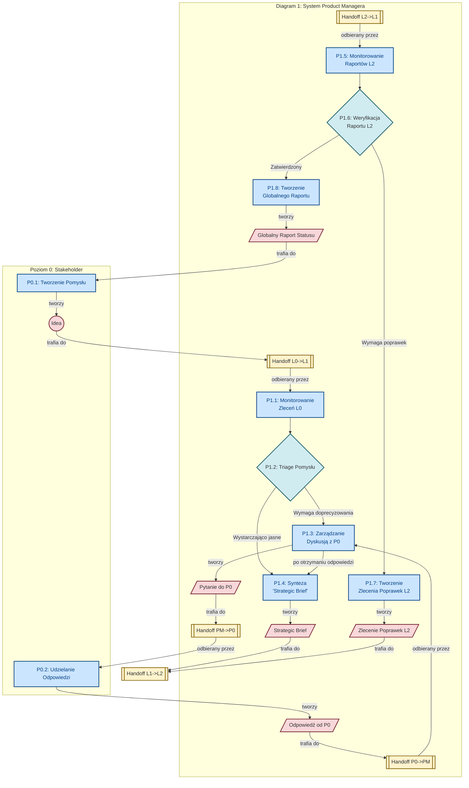
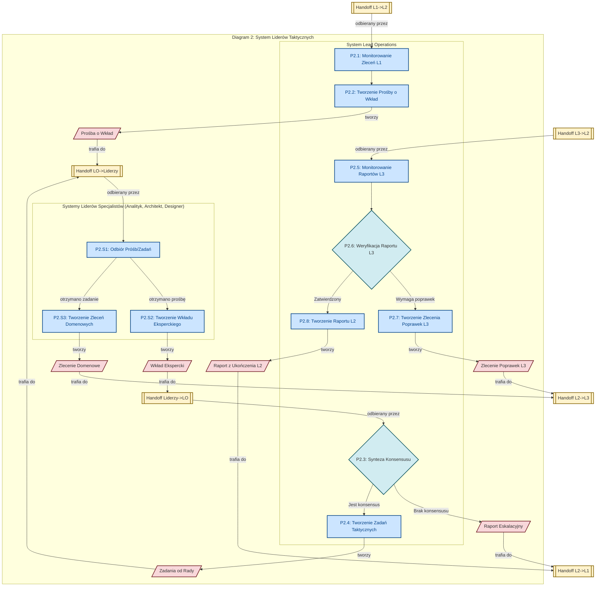
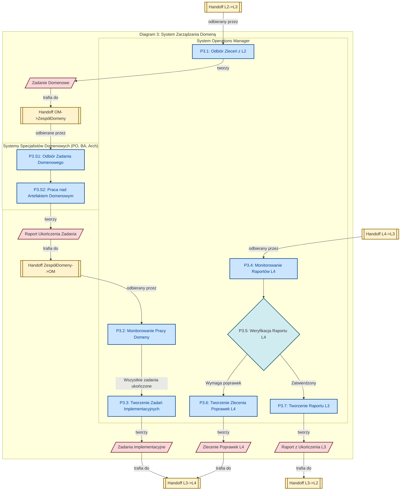
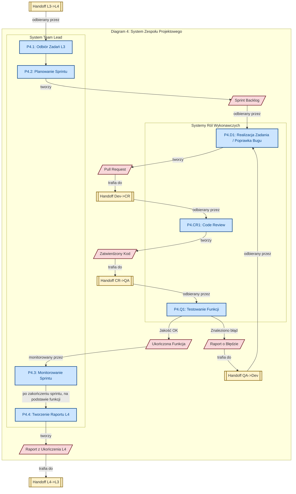

## Diagram 1: Poziom Strategiczny (0-1)

Ten diagram pokazuje, jak system Product Managera odbiera `Pomysł`, komunikuje się ze Stakeholderem wyłącznie za pomocą artefaktów `Pytanie` i `Odpowiedź` (przez dedykowane skrzynki Handoff), a następnie tworzy i deleguje `Strategic Brief`.

-----

## Diagram 2: Poziom Liderów Taktycznych (2)

Ten diagram pokazuje w pełni sformalizowaną współpracę w Radzie Strategicznej. `Lead Operations` komunikuje się z innymi Liderami wyłącznie przez artefakty `Prośba o Wkład` i `Wkład Ekspercki`, przekazywane przez dedykowane skrzynki Handoff.

-----

## Diagram 3: Poziom Zarządzania Domeną (3)

Ten diagram eliminuje abstrakcyjne "angażowanie" w `Workspace`. `Operations Manager` tworzy konkretne `Zadania Domenowe` dla specjalistów, a ci odsyłają `Raporty Ukończenia Zadań`, zanim `OM` stworzy zbiorcze zadania dla L4.

-----

## Diagram 4: Poziom Zespołu Projektowego (4)

Ostatni diagram pokazuje w pełni sformalizowaną pętlę sprintu. Komunikacja między Developerem a QA odbywa się wyłącznie za pomocą artefaktów `Pull Request` i `Bug Report` przekazywanych przez dedykowane skrzynki Handoff.

