# Plan implementacji Yggdrasil — kompletne repozytorium

## Kontekst

Yggdrasil to ewolucja podejscia Spec-Driven Development (spec-kit) o kilka krokow dalej. Spec-kit operuje na plaskch specyfikacjach. Yggdrasil wprowadza **graf architektoniczny** jako formalna warstwe posrednia miedzy intencja a kodem. Repozytorium musi byc kompletne i gotowe do publicznej publikacji na GitHub, analogicznie do spec-kit.

## Mapa repozytorium (stan docelowy)

```
Yggdrasil/
  # ── Infrastruktura open-source ──
  README.md                          # Glowny README z instalacja, quick start, badges
  LICENSE                            # MIT
  CONTRIBUTING.md                    # Jak kontrybuowac
  CODE_OF_CONDUCT.md                 # Contributor Covenant
  SECURITY.md                        # Polityka zglaszania vulnerabilities
  SUPPORT.md                         # Gdzie szukac pomocy
  CHANGELOG.md                       # Keep a Changelog format
  AGENTS.md                          # Multi-agent support (architektura, dodawanie agentow)
  .markdownlint-cli2.jsonc           # Konfiguracja lintera markdown

  # ── Konfiguracja repo ──
  .editorconfig                      # (istniejacy, aktualizacja)
  .gitignore                         # (istniejacy, aktualizacja)
  .gitattributes                     # (istniejacy, aktualizacja)
  Yggdrasil.code-workspace           # (istniejacy, aktualizacja pod ygg)

  # ── DevContainer ──
  .devcontainer/
    devcontainer.json                # Node.js 22 + TypeScript + AI agents
    Dockerfile                       # (istniejacy, aktualizacja)
    post-attach.sh                   # Instalacja ygg CLI + agent setup

  # ── GitHub Actions ──
  .github/
    workflows/
      ci.yml                         # Lint + Test + Build na push/PR
      release.yml                    # Automated npm publish + GitHub Release
      docs.yml                       # Deploy dokumentacji
    CODEOWNERS                       # Code ownership
    ISSUE_TEMPLATE/
      bug_report.md
      feature_request.md
    pull_request_template.md

  # ── Dokumentacja v2 (specyfikacja — istniejaca) ──
  documentation/v2/
    01-vision.md ... 10-adoption.md  # Pelna specyfikacja (juz istnieje)
    README.md

  # ── CLI (@yggdrasil/cli) ──
  source/cli/
    package.json
    tsconfig.json
    vitest.config.ts
    tsup.config.ts
    README.md                        # README pakietu npm
    src/
      bin.ts                         # Entry point
      cli/                           # Definicje komend CLI
      core/                          # Logika biznesowa
      io/                            # Parsery i I/O
      model/                         # Typy TypeScript
      formatters/                    # Formatowanie wyjscia
      templates/                     # Szablony komend agentowych
        commands/                    # 9 kanonicznych promptow (md)
        adapters/                    # Konwersja per agent
      utils/                         # Utility (hash, tokens, paths)
    tests/
      unit/
      integration/
      e2e/
      fixtures/

  # ── Dokumentacja uzytkownika (site) ──
  docs/
    index.md                         # Landing page
    getting-started.md               # Quick start
    installation.md                  # Instalacja
    concepts.md                      # Kluczowe koncepcje
    graph-guide.md                   # Jak budowac graf
    cli-reference.md                 # Referencja CLI
    agent-commands.md                # Referencja komend agentowych
    adoption-guide.md                # Greenfield / Brownfield
    faq.md                           # FAQ
    .vitepress/config.ts             # VitePress config (static site generator)
```

---

## Faza 0: Infrastruktura repozytorium

Przygotowanie repozytorium do standardu open-source.

### 0a. Pliki root-level


| Plik                 | Wzorzec                   | Uwagi                                                                                                                                           |
| -------------------- | ------------------------- | ----------------------------------------------------------------------------------------------------------------------------------------------- |
| `README.md`          | spec-kit README           | Badges (CI, npm, license), instalacja, quick start, concept map, lista komend CLI, lista komend agentowych, supported agents, contributing link |
| `LICENSE`            | MIT                       | Standardowa licencja MIT                                                                                                                        |
| `CONTRIBUTING.md`    | spec-kit CONTRIBUTING     | Prerequisites (Node 22+, npm), dev container setup, PR process, AI contribution disclosure                                                      |
| `CODE_OF_CONDUCT.md` | Contributor Covenant v2.1 | Standardowy                                                                                                                                     |
| `SECURITY.md`        | spec-kit SECURITY         | Zglaszanie vulnerabilities                                                                                                                      |
| `SUPPORT.md`         | spec-kit SUPPORT          | GitHub Issues, docs link                                                                                                                        |
| `CHANGELOG.md`       | Keep a Changelog          | Wersja 0.1.0 jako pierwszy release                                                                                                              |
| `AGENTS.md`          | spec-kit AGENTS           | Architektura multi-agent, jak dodac nowego agenta, tabela wspieranych agentow                                                                   |


### 0b. Aktualizacja istniejacych plikow konfiguracyjnych

`**.gitignore**` — dodac:

```
node_modules/
dist/
*.tgz
.yggdrasil-test/
coverage/
```

`**.editorconfig**` — bez zmian (juz poprawny: UTF-8, LF, 2 spacje).

`**Yggdrasil.code-workspace**` — aktualizacja:

- Dodac `chat.promptFilesRecommendations` dla ygg komend
- Dodac `chat.tools.terminal.autoApprove` dla ygg CLI
- Zaktualizowac spell checker words (yggdrasil, materialize, etc.)
- Dodac rekomendacje rozszerzen VS Code

`**.markdownlint-cli2.jsonc**` — nowy plik, konfiguracja lintera markdown.

### 0c. DevContainer

Aktualizacja `.devcontainer/` pod Node.js 22 + TypeScript:

`**Dockerfile**` — baza: `mcr.microsoft.com/devcontainers/typescript-node:22` (zamiast ubuntu base):

- Node.js 22 LTS pre-installed
- npm/npx available

`**devcontainer.json**` — aktualizacja:

- Zmiana image na nowy Dockerfile
- Features: git, docker-in-docker (bez zmian)
- VS Code extensions: dodac ESLint, Prettier, Vitest explorer
- Post-attach: instalacja ygg CLI z local path

`**post-attach.sh**` — aktualizacja:

- `cd source/cli && npm install && npm link` (link globalny ygg)
- Instalacja agentow AI (Claude CLI, Gemini CLI, etc. — wzorzec ze spec-kit)

### 0d. GitHub Actions

`**ci.yml**` — na push do main i PR:

```yaml
jobs:
  lint:
    - markdownlint (pliki md)
    - eslint (source/cli)
  test:
    - npm test (vitest)
    - pokrycie kodu
  build:
    - npm run build (tsup)
    - ygg check na fixture'ach (smoke test)
```

`**release.yml**` — na tag `v*`:

```yaml
jobs:
  publish:
    - npm run build
    - npm publish (do npm registry)
    - Utworzenie GitHub Release z changelog
    - Attachment: pakiety per agent (analogicznie do spec-kit)
```

`**docs.yml**` — na zmiany w `docs/`:

- Build VitePress
- Deploy na GitHub Pages

**Issue/PR templates:**

- `bug_report.md` — szablon zgloszenia bledu
- `feature_request.md` — szablon propozycji feature'a
- `pull_request_template.md` — checklist PR (testy, docs, changelog)
- `CODEOWNERS` — wlasciciele kodu

---

## Faza 1: Projekt CLI — setup

Inicjalizacja pakietu npm w `source/cli/`.

`**package.json`:**

```json
{
  "name": "@gaiaan/yggdrasil-cli",
  "version": "0.1.0",
  "type": "module",
  "bin": { "ygg": "./dist/bin.js" },
  "files": ["dist/", "templates/"],
  "engines": { "node": ">=22" }
}
```

**Zaleznosci:**

- `commander` — CLI framework
- `yaml` — parser YAML 1.2
- `chalk` — kolory terminala
- `js-tiktoken` — estymacja tokenow

**Dev zaleznosci:**

- `typescript`, `tsup`, `vitest`, `eslint`, `prettier`

**Pliki konfiguracyjne:**

- `tsconfig.json` — target ES2022, module NodeNext, strict
- `tsup.config.ts` — entry: src/bin.ts, format: esm, dts: true
- `vitest.config.ts` — coverage provider: v8
- `eslint.config.js` — flat config, TypeScript rules
- `.prettierrc` — zgodny z .editorconfig

**Entry point `src/bin.ts`:**

```typescript
#!/usr/bin/env node
import { program } from 'commander';
// rejestracja komend...
program.parse();
```

---

## Faza 2: Model danych i parsery

### Typy (`src/model/types.ts`)

Kompletny system typow TypeScript odwzorowujacy specyfikacje:

- `YggConfig`, `TagDefinition` — config.yaml
- `NodeMeta`, `Relation` — node.yaml
- `GraphNode`, `Artifact` — node w grafie
- `AspectDef` — pliki aspektow
- `FlowDef` — flow.yaml
- `Graph` — kompletny graf (Map<string, GraphNode> + config + aspects + flows)
- `DriftState`, `DriftEntry` — stan driftu
- `ContextPackage`, `Layer` — pakiet kontekstu
- `ValidationResult`, `Issue` — wyniki walidacji
- `Stage` — etap materializacji

### Parsery (`src/io/`)

Czyste funkcje: plik -> struktura danych.

- `config-parser.ts` — config.yaml
- `node-parser.ts` — node.yaml (normalizacja mapping.path do tablicy)
- `aspect-parser.ts` — pliki z aspects/
- `flow-parser.ts` — flow.yaml + artefakty katalogu flow
- `artifact-reader.ts` — wszystkie pliki z katalogu node'a (filtr binarnych)
- `drift-state-store.ts` — .drift-state (read/write)

### GraphLoader (`src/core/graph-loader.ts`)

Rekurencyjne skanowanie `yggdrasil/`:

1. config.yaml -> YggConfig
2. Rekurencja katalogow -> GraphNode (jesli node.yaml istnieje)
3. Artefakty z katalogu node'a
4. Drzewo parent-child z hierarchii
5. Aspekty z aspects/
6. Flowy z flows/
7. Return: Graph

**Testowanie:** Fixture w `tests/fixtures/` z kompletnym mini-grafem. Testy jednostkowe parserow.

---

## Faza 3: Silnik kontekstu (build-context)

Najwazniejszy komponent — 6-warstwowy assembler kontekstu.

### ContextBuilder (`src/core/context-builder.ts`)

Warstwy (w kolejnosci):

1. **Global** — config.yaml (stack, standards)
2. **Hierarchical** — artefakty przodkow (root -> parent)
3. **Own** — artefakty node'a
4. **Relational** — artefakty z relations[] (tylko bezposrednie, nie rekurencyjne)
5. **Aspects** — aspekty pasujace do tagow (wlacznie z propagacja od rodzicow)
6. **Flows** — artefakty flow'ow z udzialem node'a

Logika propagacji tagow: jesli tag ma `propagates: true`, dzieci dziedzicza tagi rodzica.

### Formatery (`src/formatters/`)

- `markdown.ts` — dokument markdown wg schematu ze specyfikacji (sekcje: Global, Module, Node, Dependencies, Aspects, Flows, Materialization Target, footer z tokenami)
- `json.ts` — struktura JSON z tymi samymi danymi

### Komenda CLI (`src/cli/build-context.ts`)

```bash
ygg build-context <node-path> [--format markdown|json]
```

Exit codes: 0 (ok), 1 (node not found), 2 (broken relation).
Ostrzezenie na stderr gdy przekroczone context_warning_tokens.

---

## Faza 4: Dependency Resolver (resolve-deps)

### DependencyResolver (`src/core/dependency-resolver.ts`)

Algorytm:

1. Zbierz node'y (all / --changed / --node)
2. Wyklucz blackbox: true
3. Zbuduj graf zaleznosci z relations[]
4. Detekcja cykli (DFS z kolorowaniem)
5. Sortowanie topologiczne (algorytm Kahna)
6. Grupowanie w stage'e (parallel: true jesli >1 node)

Tryb `--changed`: porownanie timestamps graf vs kod + kaskada zmian interfejsow.

### Komenda CLI

```bash
ygg resolve-deps [--changed] [--node <path>] [--format text|json]
```

Exit codes: 0 (ok), 1 (cycle), 2 (broken relation).

---

## Faza 5: Validator (check)

### Validator (`src/core/validator.ts`)

9 regul walidacji (kazda jako osobna funkcja):

1. Relation targets exist
2. Tags defined in config.yaml
3. Aspects reference valid tags
4. No circular dependencies
5. Unique mapping paths
6. Directories have node.yaml (excl. aspects/, flows/, .briefs/)
7. Flow participants exist
8. No conflicting tags (conflicts_with)
9. Context budget (soft warning, nie blokuje)

### Komenda CLI

```bash
ygg check [--format text|json]
```

Exit codes: 0 (ok), 1 (issues).

---

## Faza 6: Drift Detector (drift)

### DriftDetector (`src/core/drift-detector.ts`)

Stany: OK, DRIFT, MISSING, UNMATERIALIZED.
Hashowanie SHA-256 via node:crypto. Multi-file mapping: hash per plik.

### DriftStateStore (`src/io/drift-state-store.ts`)

Read/write `.drift-state` (YAML z entries per node).

### Komenda CLI

```bash
ygg drift [--node <path>] [--format text|json]
ygg drift --absorb <node-path>
```

`--absorb` aktualizuje .drift-state bez modyfikacji grafu.
Exit codes: 0 (clean), 1 (drift), 2 (missing).

---

## Faza 7: Komendy pomocnicze CLI

### `ygg init [--agent <name>]`

1. Tworzy `yggdrasil/` (config.yaml skeleton, aspects/, flows/, .briefs/)
2. Kopiuje szablony komend agentowych do odpowiedniego katalogu:
  - `--agent claude` -> `.claude/commands/ygg-*.md`
  - `--agent cursor` -> `.cursor/commands/ygg-*.md`
  - `--agent copilot` -> `.github/agents/ygg-*.md`
  - `--agent gemini` -> `.gemini/commands/ygg-*.toml`
  - Bez flagi -> interaktywny wybor agenta
3. Wypisuje next steps

### `ygg status`

Agregacja: node'y per typ, tagi, aspekty, relacje, mappingi, materializacja, drift.

### `ygg affected <node-path> [--format text|json]`

Odwrotne przeszukiwanie: kto zalezy od podanego node'a (relations + flows).

### `ygg tree [--depth N] [--tags|--no-tags]`

Renderowanie drzewa z metadanymi (├── / └──), tagi, artefakty, mapping.

---

## Faza 8: Szablony komend agentowych (prompty)

To jest kluczowa faza — prompty to interfejs miedzy CLI a agentem AI.

### 8a. Architektura

```
src/templates/
  commands/                    # 9 kanonicznych promptow (markdown)
    ygg-brief.md
    ygg-clarify.md
    ygg-plan.md
    ygg-apply.md
    ygg-check.md
    ygg-materialize.md
    ygg-drift.md
    ygg-define.md
    ygg-ingest.md
  adapters/                    # Konwersja per agent
    claude.ts                  # md -> .claude/commands/
    cursor.ts                  # md -> .cursor/commands/
    copilot.ts                 # md -> .github/agents/ (+ mode: frontmatter)
    gemini.ts                  # md -> toml -> .gemini/commands/
```

**Jedno zrodlo prawdy:** komendy w `commands/` jako markdown. Adaptery konwertuja format. Nie utrzymujemy osobnych kopii per agent.

### 8b. Format pliku komendy

```markdown
---
description: "Short description for command picker"
handoffs:
  - command: /ygg.plan
    label: "Plan graph changes"
    prompt: "Run /ygg.plan to propose graph changes."
cli_tools:
  - ygg tree
  - ygg build-context
---

# /ygg.command-name

## Context
When to use. What it does. What it does NOT do.

## Prerequisites
What must exist before running.

## Input
$ARGUMENTS — what the user provides.

## Workflow
Numbered steps. Each step:
- Action for the agent
- CLI tool to call (if any)
- What to do with output
- Decision points

## Output
What the command produces. Where it saves.

## Handoffs
What to suggest next.

## Rules
Constraints. What the agent must NOT do.
```

### 8c. Tabela komend


| Komenda            | CLI tools                     | Handoffs             | Mutuje?               |
| ------------------ | ----------------------------- | -------------------- | --------------------- |
| `/ygg.brief`       | (brak)                        | -> clarify, plan     | .briefs/              |
| `/ygg.clarify`     | (brak)                        | -> plan              | brief file            |
| `/ygg.plan`        | tree, build-context, affected | -> apply             | nie (propozycja)      |
| `/ygg.apply`       | check                         | -> materialize       | yggdrasil/            |
| `/ygg.check`       | check                         | -> apply (fix)       | nie                   |
| `/ygg.materialize` | resolve-deps, build-context   | -> drift             | kod zrodlowy          |
| `/ygg.drift`       | drift                         | -> materialize/apply | .drift-state (absorb) |
| `/ygg.define`      | check                         | -> materialize       | yggdrasil/            |
| `/ygg.ingest`      | check                         | -> plan              | yggdrasil/ (blackbox) |


### 8d. Szczegoly per prompt

Kazdy prompt musi zawierac pelne instrukcje workflow (analogicznie do spec-kit commands):

- `**/ygg.brief**` — strukturyzacja wymagan (Context/Requirements/Acceptance Criteria), mandatory questions (data model? wiele node'ow? wybory architektoniczne?), rekomendowane odpowiedzi, zapis do .briefs/
- `**/ygg.clarify**` — 5 kategorii analitycznych, sekwencyjne pytania, appending clarifications do brief
- `**/ygg.plan**` — `ygg tree` na start, `ygg build-context` dla dotkietych node'ow, `ygg affected` dla kaskady, proaktywne sugerowanie splitow, propozycja flow'ow
- `**/ygg.apply**` — tworzenie katalogow + node.yaml + artefaktow, `ygg check` po zmianach, obsluga splitow
- `**/ygg.check**` — uruchomienie `ygg check`, wyjasnienie kazdego problemu, sugestie fix'ow
- `**/ygg.materialize**` — `ygg resolve-deps` -> stage list, per node: `ygg build-context` -> generuj kod/testy -> zapisz, context package = jedyne zrodlo prawdy, ZAKAZ czytania kodu innych modulow
- `**/ygg.drift**` — `ygg drift` -> raport, per node: pokaz diff + Absorb/Reject, obsluga obu sciezek
- `**/ygg.define**` — konwersacyjne definiowanie node'a, minimum: name + type + description.md
- `**/ygg.ingest**` — skanowanie kodu, grupowanie po odpowiedzialnosci (5-15 node'ow), blackbox: true, uczciwe opisy wlacznie z problemami

### 8e. Adaptery per agent


| Agent          | Katalog             | Format | Placeholder  | Specyfika             |
| -------------- | ------------------- | ------ | ------------ | --------------------- |
| Claude Code    | `.claude/commands/` | md     | `$ARGUMENTS` | Standardowy           |
| Cursor         | `.cursor/commands/` | md     | `$ARGUMENTS` | Standardowy           |
| GitHub Copilot | `.github/agents/`   | md     | `$ARGUMENTS` | `mode:` w frontmatter |
| Gemini CLI     | `.gemini/commands/` | toml   | `{{args}}`   | Konwersja md->toml    |


Adapter gemini konwertuje: frontmatter YAML -> TOML header, `$ARGUMENTS` -> `{{args}}`, sekcje md -> pola TOML.

`ygg init --agent <name>` wywoluje odpowiedni adapter i kopiuje pliki.

---

## Faza 9: Dokumentacja uzytkownika (docs site)

Statyczna strona dokumentacji budowana VitePress (Node.js native, markdown-first).

### Struktura `docs/`

```
docs/
  .vitepress/
    config.ts                  # VitePress config (theme, nav, sidebar)
  index.md                     # Landing page (hero, features, quick links)
  getting-started.md           # 5-minutowy quick start
  installation.md              # Instalacja CLI + init
  concepts.md                  # Graf, Node, Artifact, Tag, Aspect, Flow
  graph-guide.md               # Jak projektowac graf
  cli-reference.md             # Pelna referencja CLI (z 06-cli-reference.md)
  agent-commands.md            # Referencja /ygg.* komend
  workflow.md                  # Pipeline brief->materialize
  adoption-guide.md            # Greenfield / Brownfield / Ingest
  faq.md                       # FAQ
```

Tresc bazuje na dokumentacji v2 (`documentation/v2/`) ale jest przeformatowana na format user-facing (krotsze, z przyklady, z linkami miedzy stronami).

VitePress buduje statyczna strone -> deploy na GitHub Pages via `docs.yml` workflow.

---

## Faza 10: Testy

### Strategia

```
tests/
  unit/                        # Czyste funkcje: parsery, resolver, validator, drift
  integration/                 # Pipeline: graph-loader -> context-builder -> output
  e2e/                         # CLI jako subprocess (ygg check, ygg tree, etc.)
  fixtures/
    sample-project/
      yggdrasil/               # Kompletny mini-graf (3 moduly, 8 node'ow)
        config.yaml
        aspects/
        flows/
        auth/
          node.yaml
          login-service/
          auth-api/
        orders/
          node.yaml
          order-service/
        users/
          node.yaml
          user-repository/
      src/                     # Zmockowane pliki kodu (dla drift tests)
```

- **Snapshot testy** — build-context output (markdown i JSON)
- **E2E** — `ygg` jako subprocess: stdin/stdout/exit codes
- **Pokrycie** — cel 80%+
- **CI** — vitest w GitHub Actions

---

## Faza 11: Pakietowanie i release

- `tsup` buduje `dist/` (ESM, deklaracje typow)
- `files` w package.json: `["dist/", "templates/"]` (szablony komend wchodza do pakietu)
- `bin.ygg` -> `dist/bin.js`
- `npm pack` -> `yggdrasil-cli-0.1.0.tgz`
- GitHub Actions `release.yml`: na tag `v*` -> npm publish + GitHub Release
- CHANGELOG.md aktualizowany przy kazdym release

---

## Kolejnosc implementacji

```mermaid
gantt
  title Kolejnosc implementacji
  dateFormat X
  axisFormat %s

  section RepoInfra
  Faza0_Infrastruktura: f0, 0, 2

  section CLI_Setup
  Faza1_Projekt: f1, after f0, 1
  Faza2_Model_Parsery: f2, after f1, 3

  section CLI_Core
  Faza3_ContextBuilder: f3, after f2, 3
  Faza4_ResolveDeps: f4, after f2, 2
  Faza5_Validator: f5, after f3, 2
  Faza6_DriftDetector: f6, after f2, 2

  section CLI_Commands
  Faza7_Komendy: f7, after f5, 2

  section AgentCommands
  Faza8_Prompty: f8, after f7, 3

  section Docs
  Faza9_Docs: f9, after f7, 2

  section Quality
  Faza10_Testy: f10, after f8, 2
  Faza11_Release: f11, after f10, 1
```




Kluczowe zaleznosci:

- Faza 0 (infrastruktura repo) moze byc robiona niezaleznie od CLI
- Fazy 3, 4, 6 moga byc realizowane rownolegle po fazie 2
- Faza 8 (prompty) wymaga gotowego CLI (zeby instrukcje odnosily sie do istniejacych komend)
- Faza 9 (docs) moze byc robiona rownolegle z faza 8
- Faza 10 (testy) moze czesc testow budowac rownolegle z implementacja (TDD)

---

## Ryzyka i decyzje

- **Nazwa pakietu npm** — `@gaiaan/yggdrasil-cli`. Wymaga organizacji `gaiaan` na npm registry.
- **VitePress vs inne** — VitePress jest natywne dla Node.js i markdown-first. Alternatywa: Docusaurus (React-based, wiecej customizacji). VitePress rekomendowany dla prostoty.
- **Estymacja tokenow** — `js-tiktoken` daje dokladne wyniki dla modeli OpenAI; dla Claude/Gemini to przyblizenie. Wystarczajace dla soft threshold.
- **Multi-agent maintenance** — 4 agentow w pierwszym release: Claude Code, Cursor, GitHub Copilot, Gemini CLI. Kolejni dodawani iteracyjnie.
- **Istniejace katalogi repo** — documentation/v0-v1.1.1, _baseline/, issues/, specifications/ zostaja bez zmian (wewnetrzna historia projektu).
- **Scope pierwszego release'a** — v0.1.0 powinno miec dzialajace: init, build-context, resolve-deps, check, drift, status, affected, tree + prompty dla min. 2 agentow. Docs site moze byc w v0.2.0.

